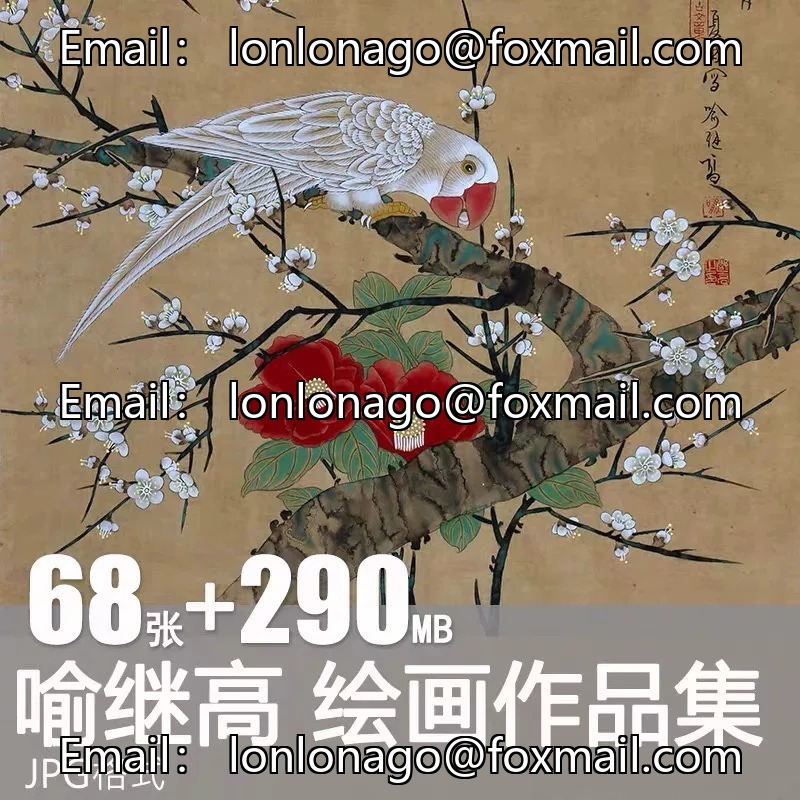
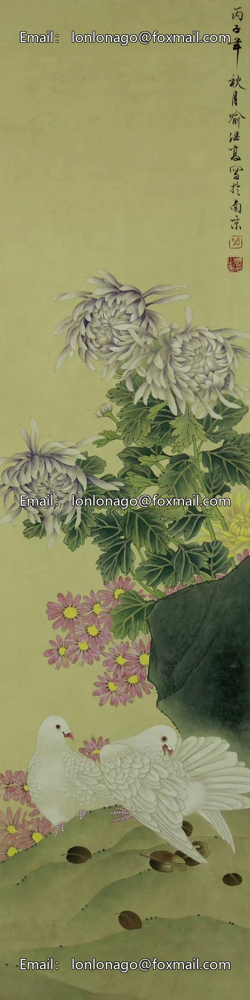
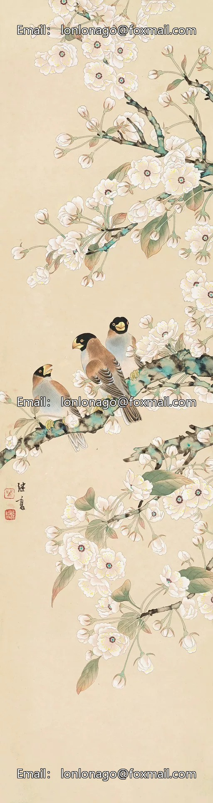
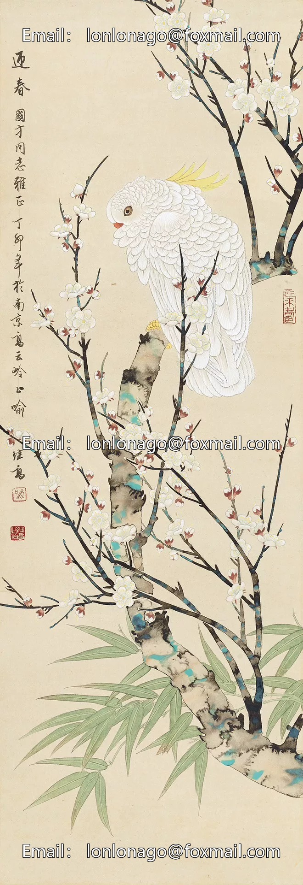
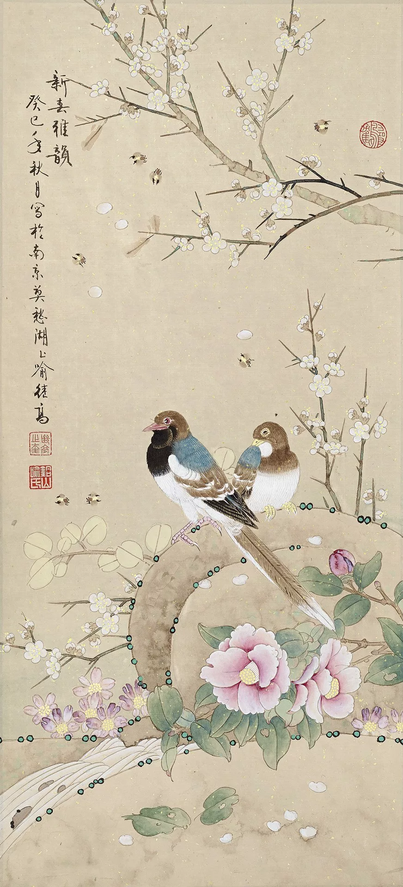
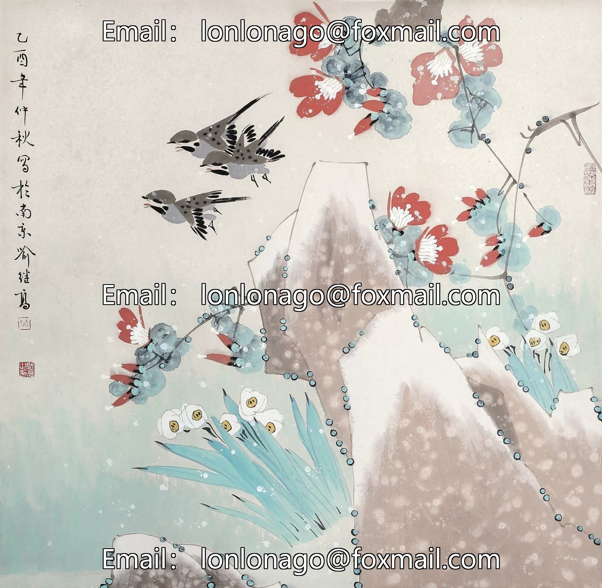
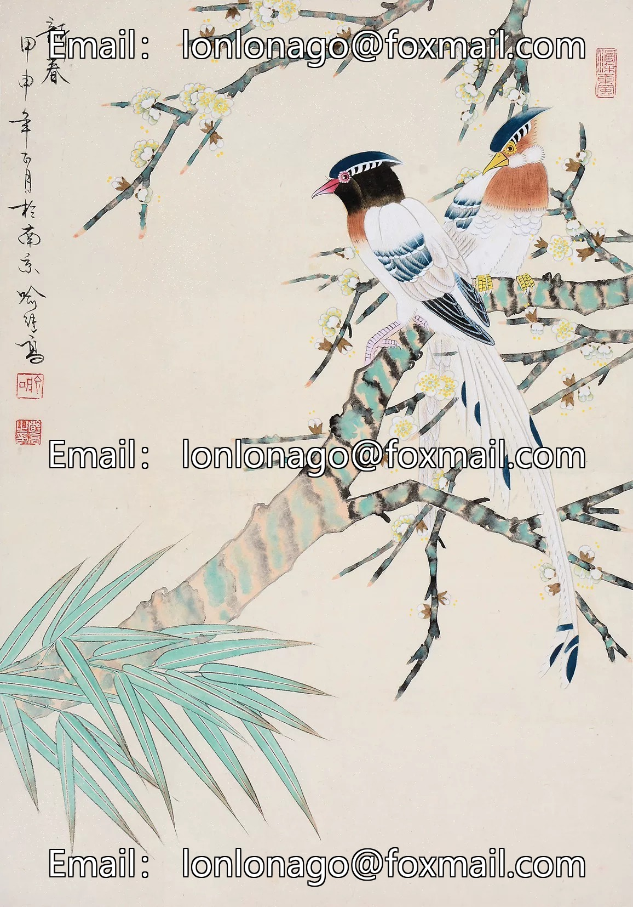
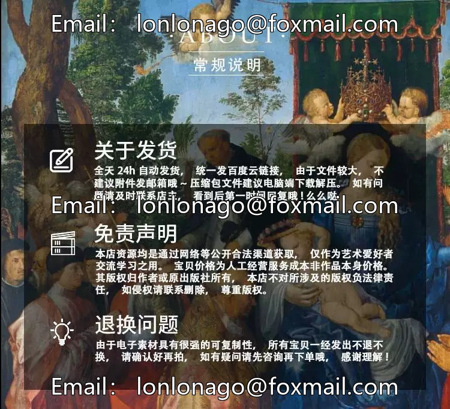

# "Second Shot Direct Hair" is a collection of exquisite Chinese ink paintings by Yu Jigao, featuring graceful cranes and watercolors. This set includes materials for copying the works of pear blossoms and pheasants, providing a rich source of inspiration for artists seeking to capture the essence of nature in their own work.

## Body

"Second Snap Direct Hair" Yu Jie Gao's fine brush painting of bird and flower national painting, immortal watercolor collection of plum blossoms and pheasant, copying materials

(Full product description was not available from the source page.)

## Images

## Payment

Here is a pay link on Stripe ( https://buy.stripe.com/3cs8yP7sY87d0vu9AB ). Please contact me lonlonago@foxmail.com after funding $89, and I will send you a complete data files , thank you!

